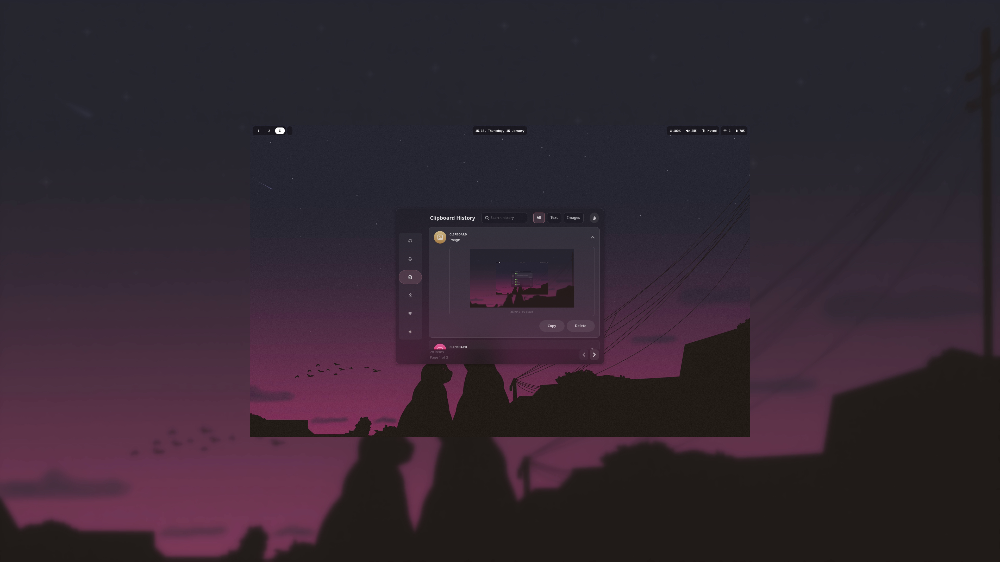
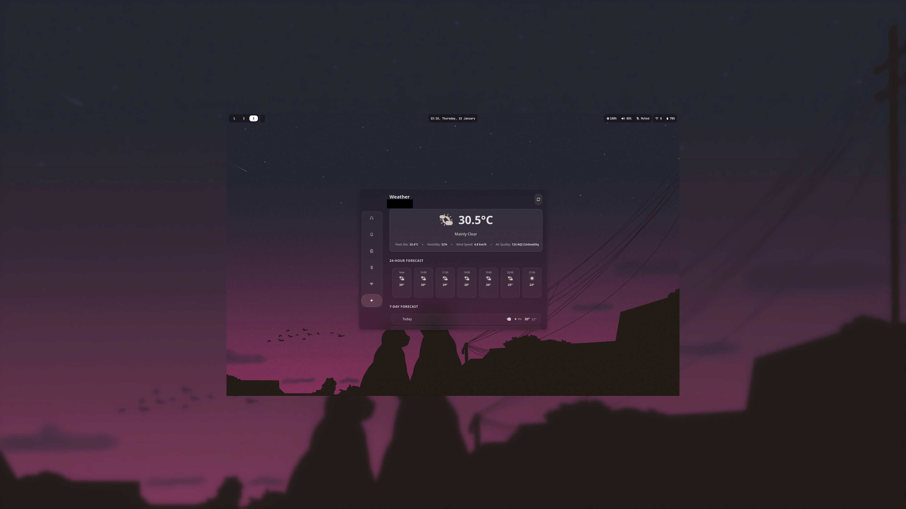
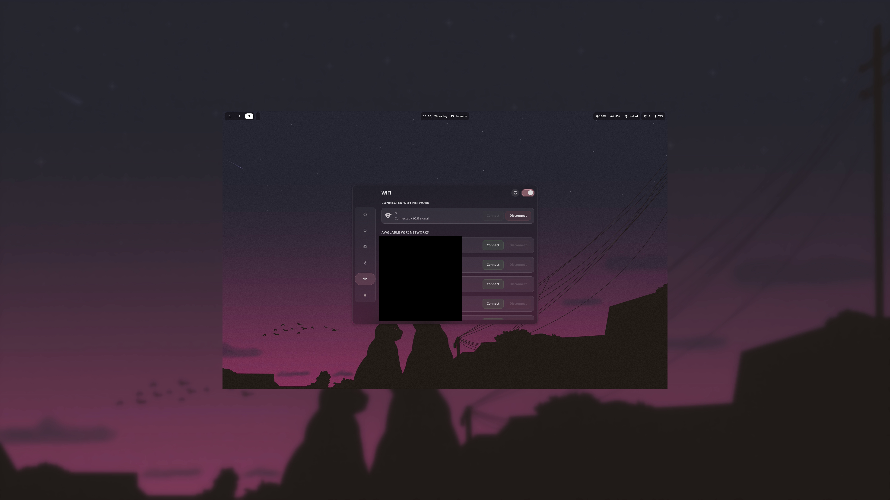

# Dashboard

A fast, GTK4/Adwaita widget dashboard for Linux desktops. Built for Hyprland but works on any Wayland compositor.


> **Note:** Sorry, had to redact some stuff for privacy.

## Screenshots

| | |
|:---:|:---:|
|  |  |
| **Media Player** | **Notifications** |
|  |  |
| **Clipboard History** | **Weather** |
|  |  |
| **Bluetooth** | **Network** |

## Features

| Widget | Description |
|--------|-------------|
| **Media** | Control any media player (Spotify, Firefox, VLC, etc.) with album art, seek bar, and player switching |
| **Notifications** | Browse notification history with search, expandable details, and clear functionality |
| **Clipboard** | Clipboard history manager |
| **Bluetooth** | Scan, pair, connect devices with battery level monitoring |
| **WiFi** | Network manager for WiFi and Ethernet connections |
| **Weather** | Current conditions + 24-hour and 7-day forecasts via Open-Meteo |

---

## How It Works

The dashboard is designed to be **instant**. Instead of launching a new Python process every time you want to check something, the app stays running in the background and you toggle its visibility with a keybind.

### The Load + Toggle System

This is the **recommended way** to use the dashboard:

1. **`--load`** - Starts the app in the background without showing the window. All widgets are pre-loaded and ready.
2. **`--toggle`** - Shows the window if hidden, hides it if visible. Instant response, no startup delay.

When you hide the window, the active widget is deactivated (stops polling, network requests, etc.) to save resources. When you show it again, everything reactivates immediately.

### Command Line Options

```bash
python dashboard.py                    # Normal launch - shows window
python dashboard.py --load             # Start hidden in background (use this on login)
python dashboard.py --toggle           # Toggle visibility (bind this to a key)
python dashboard.py --view bluetooth   # Open directly to a specific widget
python dashboard.py --quit             # Kill the background process completely
```

### Why This Design?

- **No startup lag** - The window appears instantly because Python is already running
- **Resource efficient** - Hidden widgets don't poll or make network requests
- **Single instance** - Only one process runs, subsequent calls just toggle visibility
- **Preserves state** - Your current widget and scroll position stay where you left them

---

## Installation

### Dependencies

```bash
# Arch Linux
sudo pacman -S gtk4 libadwaita python-gobject python-pillow python-numpy python-requests playerctl dunst networkmanager bluez glxinfo

# Other distros - install equivalents for:
# GTK4, libadwaita, PyGObject, Pillow, NumPy, requests, playerctl, dunst, NetworkManager, BlueZ
```

### Clone & Setup

```bash
git clone https://github.com/gaurishmehra/dashboard.git
cd dashboard
chmod +x dunst_log.py
```

### Weather Configuration

Create a `.env` file with your coordinates for the weather widget:

```env
LATITUDE=40.7128
LONGITUDE=-74.0060
```

---

## Hyprland Setup (Recommended)

This is the optimal setup for instant access to your dashboard.

### 1. Add Window Rules

Add these to your `hyprland.conf`:

```bash
# Dashboard window rules
windowrulev2 = float, class:^(one.gaurish.Dashboard)$
windowrulev2 = size 800 600, class:^(one.gaurish.Dashboard)$
windowrulev2 = center, class:^(one.gaurish.Dashboard)$
windowrulev2 = pin, class:^(one.gaurish.Dashboard)$
```

### 2. Start Services on Login

Add these to your `hyprland.conf`:

```bash
# Start notification logger (required for notification widget)
exec-once = /path/to/dashboard/dunst_log.py

# Pre-load dashboard in background (makes toggle instant)
exec-once = python /path/to/dashboard/dashboard.py --load
```

### 3. Bind Toggle to a Key

```bash
# Toggle dashboard with Super + D (or any key you prefer)
bind = SUPER, D, exec, python /path/to/dashboard/dashboard.py --toggle
```

That's it! Press `Super + D` and your dashboard appears instantly. Press it again to hide. Press `Escape` while focused to hide as well.

---

## How the Notification Logger Works

The `dunst_log.py` script runs in the background and captures all notifications from dunst via D-Bus.

### What It Does

- Monitors `org.freedesktop.Notifications` D-Bus interface
- Extracts notification data: app name, title, body, icon/image
- Handles embedded images (album art, screenshots, etc.) and converts them to PNG
- Stores everything in `~/.local/share/dunst/notifications.json`
- Auto-rotates old entries (keeps last 5000 by default)

### Running the Logger

```bash
# Make sure dunst is your notification daemon (not mako, swaync, etc.)
dunst &

# Start the logger
./dunst_log.py &

# Or with debug output
./dunst_log.py --debug
```

The notification widget in the dashboard reads from this log file and displays your notification history with search, timestamps, and the ability to clear everything.

---

## Architecture

### Lazy Loading

Widgets are imported in parallel background threads at startup. The initial widget loads first, others load while you're already using the app. This means:
- Window appears in ~100ms
- All widgets ready within ~500ms
- No blocking the UI thread

### Widget Lifecycle

Each widget has `activate()` and `deactivate()` methods:

- **activate()** - Called when widget becomes visible. Starts timers, network requests, file monitoring.
- **deactivate()** - Called when switching away or hiding window. Stops all background activity.

This means only the visible widget uses CPU/network at any time.

### GPU Detection

The app auto-detects your GPU and picks the optimal GTK renderer:
- **NVIDIA** → OpenGL renderer (hardware accelerated)
- **Intel/AMD** → Cairo renderer (avoids driver overhead)

Result is cached in `~/.cache/dashboard_gpu_renderer` so detection only runs once.

---

## Troubleshooting

### Dashboard won't start
```bash
# Check for missing dependencies
python -c "import gi; gi.require_version('Gtk', '4.0'); gi.require_version('Adw', '1')"
```

### Enable debug logs
```bash
# Quiet by default. Enable detailed logs only when debugging.
DASHBOARD_DEBUG=1 python dashboard.py

# Or set an explicit level (DEBUG, INFO, WARNING, ERROR)
DASHBOARD_LOG_LEVEL=DEBUG python dashboard.py
```

### Notifications not showing
```bash
# Make sure dunst is running and dunst_log.py is active
pgrep dunst
pgrep -f dunst_log.py

# Check the log file exists
cat ~/.local/share/dunst/notifications.json
```

### Bluetooth/WiFi not working
```bash
# Make sure services are running
systemctl status bluetooth
systemctl status NetworkManager
```

### Toggle not working
```bash
# Kill any stuck instances and restart
pkill -f dashboard.py
python dashboard.py --load
```

---

## License

See [LICENSE](LICENSE).
